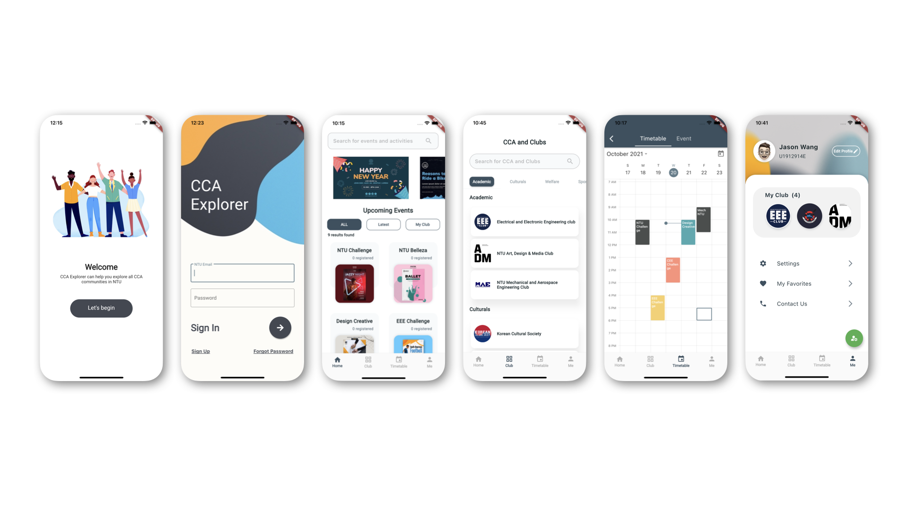

<div id="top"></div>

<!-- PROJECT SHIELDS -->
<!-- [![Contributors][contributors-shield]][contributors-url]
[![Forks][forks-shield]][forks-url]
[![Stargazers][stars-shield]][stars-url]
[![Issues][issues-shield]][issues-url]
[![LinkedIn][linkedin-shield]][linkedin-url]
 -->

<!-- PROJECT LOGO -->
<br />
<div align="center">
  <a href="https://github.com/jason45992/ccaexplorer">
    
  </a>

  <h3 align="center">CCA Explorer</h3>

  <p align="center">
    One stop Applicaiton for CCA committees!
    <br />
    <br />
    <a href="https://github.com/jason45992/ccaexplorer">View Demo</a>
    ·
    <a href="https://github.com/jason45992/ccaexplorer/issues">Report Bug</a>
    ·
    <a href="https://github.com/jason45992/ccaexplorer/issues">Request Feature</a>
  </p>
  <p align="center">
    Greatly appreciate contributions from <a href="https://github.com/CKHOR002">@CKHOR002</a>, <a href="https://github.com/gessika1316">@gessika1316</a>, <a href="https://github.com/MengYuan13">@MengYuan13</a> and <a href="https://github.com/NKLiuZN">@NKLiuZN</a>
  </p>
  </p>
</div>


<!-- TABLE OF CONTENTS -->
<details>
  <summary>Table of Contents</summary>
  <ol>
    <li>
      <a href="#about-the-project">About The Project</a>
      <ul>
        <li><a href="#built-with">Built With</a></li>
      </ul>
    </li>
    <li>
      <a href="#getting-started">Getting Started</a>
      <ul>
        <li><a href="#prerequisites">Prerequisites</a></li>
        <li><a href="#installation">Installation</a></li>
      </ul>
    </li>
    <li><a href="#contributing">Contributing</a></li>
    <li><a href="#contact">Contact</a></li>
    <li><a href="#acknowledgments">Acknowledgments</a></li>
  </ol>
</details>


<!-- ABOUT THE PROJECT -->
## About The Project

<!-- [![Product Name Screen Shot][product-screenshot]](https://example.com) -->


Since we are faced with the problem that NTU does not have one systematic platform (Web/App) which has access to all CCAs’ contact info and registration links. CCAs cannot publicize their club activities efficiently. In addition, students are unable to attend face-to-face briefing sessions of CCA clubs due to the Covid-19 situation while online sharing is ineffective and not widespread.

We aim to offer an APP to have the following features:
* All upcoming events in ONE page
* All club information in ONE list
* ONE-button event and club registration 
* One personalised timetable of registered activities schedule
* Club committee perform management in ONE platform 


<p align="right">(<a href="#top">back to top</a>)</p>


### Built With

Here are major frameworks/libraries used to bootstrap this project.

* [Dart](https://dart.dev/)
* [Flutter](https://flutter.dev/)
* [Firebase](https://firebase.google.com/)
* [Font Awesome](https://fontawesome.com/)

<p align="right">(<a href="#top">back to top</a>)</p>


<!-- GETTING STARTED -->
## Getting Started

Below are instructions on setting up the project locally.

### Prerequisites

This is an example of how to get a local copy up and running.

* For Android Studio and IntelliJ: https://flutter.dev/docs/development/tools/android-studio
* For Visual Studio Code: https://flutter.dev/docs/development/tools/vs-code

### Installation

_Below is an example of how you can instruct your audience on installing and setting up your app.
1. Clone the repo
   ```sh
   git clone https://github.com/jason45992/ccaexplorer.git
   ```
3. Install packages
   ```sh
   flutter pub get
   ```

<p align="right">(<a href="#top">back to top</a>)</p>


<!-- CONTRIBUTING -->
## Contributing

Contributions are what make the open source community such an amazing place to learn, inspire, and create. Any contributions you make are **greatly appreciated**.

If you have a suggestion that would make this better, please fork the repo and create a pull request. You can also simply open an issue with the tag "enhancement".
Don't forget to give the project a star! Thanks again!

<p align="right">(<a href="#top">back to top</a>)</p>


<!-- CONTACT -->
## Contact

Jason Wang - [@JasonWang](https://www.linkedin.com/in/jasonnw/) - jason45992@gmail.com

Project Link: [https://github.com/jason45992/ccaexplorer](https://github.com/jason45992/ccaexplorer)

<p align="right">(<a href="#top">back to top</a>)</p>


<!-- ACKNOWLEDGMENTS -->
## Acknowledgments

* [Flutter Documentation](https://flutter.dev/docs/development/tools/vs-code)
* [Get to know Firebase for Flutter](https://firebase.google.com/codelabs/firebase-get-to-know-flutter#0)
* [Font Awesome](https://fontawesome.com)

<p align="right">(<a href="#top">back to top</a>)</p>


<!-- MARKDOWN LINKS & IMAGES -->
<!-- https://www.markdownguide.org/basic-syntax/#reference-style-links -->
[contributors-shield]: https://img.shields.io/github/contributors/othneildrew/Best-README-Template.svg?style=for-the-badge
[contributors-url]: https://github.com/jason45992/ccaexplorer/graphs/contributors
[forks-shield]: https://img.shields.io/github/forks/othneildrew/Best-README-Template.svg?style=for-the-badge
[forks-url]: https://github.com/jason45992/ccaexplorer/network/members
[stars-shield]: https://img.shields.io/github/stars/othneildrew/Best-README-Template.svg?style=for-the-badge
[stars-url]: https://github.com/jason45992/ccaexplorer/stargazers
[issues-shield]: https://img.shields.io/github/issues/othneildrew/Best-README-Template.svg?style=for-the-badge
[issues-url]: https://github.com/jason45992/ccaexplorer/issues
[license-shield]: https://img.shields.io/github/license/othneildrew/Best-README-Template.svg?style=for-the-badge
[linkedin-shield]: https://img.shields.io/badge/-LinkedIn-black.svg?style=for-the-badge&logo=linkedin&colorB=555
[linkedin-url]: https://www.linkedin.com/in/jasonnw/
[product-screenshot]: images/screenshot.png
